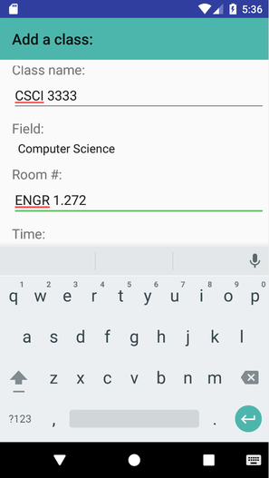
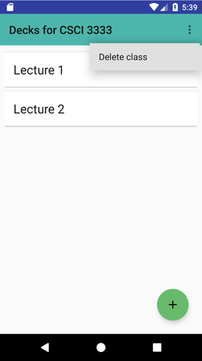
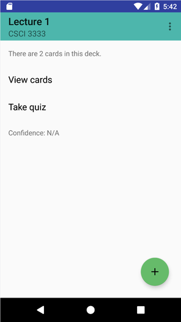
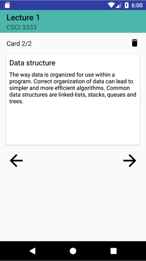
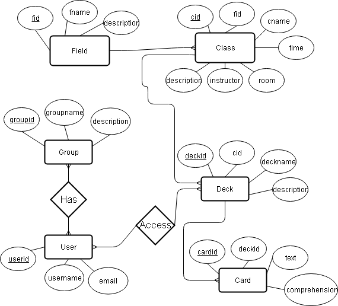

# Flashcards [Senior Project]
This simple Android app is for creating and studying interactive flashcards.

Originally written Spring 2017 for Senior Design, UTRGV Computer Science Department.
Modified and uploaded to GitHub Summer 2018.

This application was developed in Android Studio using only native Android libraries. It uses a local SQLite server for storing and retrieving information.

## Features
Basic flashcard functionality for now, including creating and deleting classes, decks, and cards. There is also a quiz feature to briefly check comprehension.

#### Examples

Adding a class.

Deleting a class deletes all the decks and cards within.

The actions you can currently take for a single deck.

Viewing a card in a deck.

##   Database
The following Entity Relationship Diagram illustrates the basic underlying structure of the implemented SQLite database.

### Known issues/TODO:
- Data loading can be improved via implementation of an Android asyctask or another threading technique.
- Similarly, activity views can be improved via implementation of loading animations.
- A more robust card editing and quiz taking system can be added, requiring redesign of some UI elements.

- User information is ignored in this local app.
- Other database models - as opposed to the relational database model here - can be considered for more efficient performance over the internet, such as a JSON "schemaless" approach.
